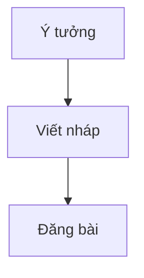

# AI TRAN — Personal Blog & Resume

A minimal, monospace-first personal site built with Astro 6, EmDash, and UnoCSS. Features an EmDash-managed blog, AI-editable content via MCP, and an interactive resume page powered by JSON Resume data.

## Tech Stack

- **Astro 6** — Server-rendered Astro site
- **EmDash** — Blog CMS, admin UI, content API, and MCP endpoint
- **Cloudflare D1/R2** — EmDash database and media storage
- **UnoCSS** — Utility-first CSS with class-based dark mode
- **TypeScript** — Strict type checking
- **JetBrains Mono** — Single font across the entire site

## Project Structure

```
src/
├── components/
│   ├── Header.astro          # Page header with optional grid background
│   ├── Footer.astro          # Site footer
│   ├── Section.astro         # Numbered section with .md filename label
│   ├── ModeToggle.astro      # Dark/light theme toggle
│   ├── FormattedDate.astro   # Date formatting component
│   └── resume/               # Resume page components
│       ├── Hero.astro
│       ├── About.astro
│       ├── Experience.astro
│       ├── Education.astro
│       ├── Skills.astro
│       └── Projects.astro
├── content/
│   ├── posts/                # Legacy markdown posts used for seed generation
│   └── authors/              # Legacy author data
├── live.config.ts            # EmDash live collection loader
├── lib/
│   └── emdash-posts.ts       # Shared post helpers for EmDash entries
├── layouts/
│   └── Layout.astro          # Root layout (nav, font, dark mode, markdown styles)
├── pages/
│   ├── index.astro           # Blog homepage from EmDash posts
│   ├── blog/[...slug].astro  # Individual blog post
│   ├── resume.astro          # Interactive CV from cv.json
│   └── admin.astro           # Redirects to EmDash admin
└── consts.ts                 # Site-wide constants
cv.json                       # Resume data (JSON Resume standard)
wrangler.jsonc                # Cloudflare Workers/D1/R2 bindings
uno.config.ts                 # UnoCSS theme, shortcuts, variants
```

## EmDash Content

Blog posts are loaded from EmDash at runtime. The initial migration seed is generated from `src/content/posts/*.md` into `.emdash/seed.json`.

| Field       | Type                    | Required |
|:------------|:------------------------|:---------|
| title       | string                  | yes      |
| description | string                  | no       |
| pub_date    | date                    | no       |
| tags        | string[]                | no       |
| type        | announcement/release/post | no     |
| content     | portable text           | yes      |

Admin UI:

- Local/dev: `http://localhost:4321/_emdash/admin`
- Production: `https://leolion.naai.studio/_emdash/admin`
- `/admin` redirects to the EmDash admin.

AI/MCP endpoint after deploy:

- `https://leolion.naai.studio/_emdash/api/mcp`

## Commands

```sh
pnpm install          # Install dependencies
pnpm dev              # Start dev server at localhost:4321
pnpm emdash:seed      # Regenerate .emdash/seed.json from legacy markdown
pnpm emdash:dev       # Start EmDash local development tooling
pnpm build            # Type check + build to ./dist/
pnpm preview          # Preview production build
```

## Cloudflare Setup

Create a D1 database and an R2 bucket, then update `wrangler.jsonc`:

```sh
pnpm wrangler d1 create personal-blog-emdash-db
pnpm wrangler r2 bucket create personal-blog-emdash-media
```

Set the generated D1 `database_id` in `wrangler.jsonc`. Then generate and store the EmDash encryption secret:

```sh
pnpm emdash secrets generate
pnpm wrangler secret put EMDASH_ENCRYPTION_KEY
```

## Design Decisions

- **Single font**: JetBrains Mono applied at `<body>` level via UnoCSS `font-mono` class. No `font-mono` scattered across components.
- **Dark mode**: Class-based (`presetUno({ dark: 'class' })`), persisted in `localStorage`, applied before first paint via inline script.
- **Blog layout**: Each post displayed as a numbered section with the legacy `.md` filename label preserved for the visual system.
- **Markdown styles**: Full markdown support in `.content-wrapper` — headings, lists (custom `::before` markers for GitBook-style alignment), blockquotes, code blocks, tables, images, callouts, Mermaid diagrams, and responsive media embeds.
- **Resume data**: Sourced from `cv.json` via TypeScript path alias `@cv`, following the JSON Resume standard.

## Writing Blog Content

### Mermaid diagrams

Blog posts support Mermaid fenced code blocks:

````md

````

Mermaid diagrams are rendered client-side to match the site's monospace visual system and dark mode.

### Video and rich embeds

Blog posts also support raw HTML media embeds inside Markdown, including `<iframe>` and `<video>`.

Example YouTube embed:

```html
<iframe
  src="https://www.youtube.com/embed/dQw4w9WgXcQ"
  title="YouTube video player"
  loading="lazy"
  allow="accelerometer; autoplay; clipboard-write; encrypted-media; gyroscope; picture-in-picture; web-share"
  referrerpolicy="strict-origin-when-cross-origin"
  allowfullscreen
></iframe>
```

These embeds are styled responsively inside `.content-wrapper`. Plain video links remain normal links unless you embed them with HTML.

## License

MIT
