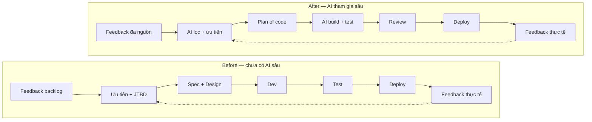

Mình là **Ái Trần** — **PO of AI & Automation tại VeXeRe**.

Mình có hơn 10 năm làm sản phẩm, đi từ UI/UX design sang product, từng làm phần mềm cho vận hành trong các lĩnh vực E-commerce, Logistics và Hospitality. Mình cũng đã tham gia các dự án AI từ 5–7 năm trước, trước cả làn sóng Generative AI bùng nổ, và đã production nhiều AI features trong môi trường thực tế.

Bài viết này không phải để nói về “AI sẽ thay thế ai”.
Mình muốn nói về một thứ thực tế hơn: **AI đang rút ngắn vòng lặp phát triển sản phẩm như thế nào**.

Và không, mình không chỉ nói về chuyện code nhanh hơn.
Điều đang thay đổi là gần như toàn bộ phần việc “trước khi code bắt đầu” cũng đang được nén lại rất mạnh.

---

## Từ “ship theo sprint” sang “ship theo vòng lặp phản hồi”

Trong nhiều năm, vòng lặp quen thuộc của team product thường là:

- Nhận feedback khách hàng
- Tổng hợp & phân tích
- Viết spec
- Thiết kế
- Dev
- Test
- Deploy

Quy trình này không sai. Nhưng nó chậm, và trong nhiều thị trường, chậm là thua.

Vấn đề là phần tốn thời gian nhất nhiều khi còn chưa tới đoạn dev bắt đầu code.
Trước khi một feature được build, team đã phải đi qua một đống việc “vô hình”:

- lọc feedback từ khách hàng, sales, support, business
- chọn cái nào đáng làm trước, cái nào để sau
- phân tích JTBD và use case
- soi hệ thống hiện tại để hiểu constraint
- tìm giải pháp, thử giải pháp, rồi mới tới build

Có những tính năng chỉ riêng phần này đã ngốn vài tuần, thậm chí cả tháng, trước khi dòng code đầu tiên được viết.

Điều đang thay đổi rất nhanh là:
một feedback từ khách hàng, hoặc thậm chí một ý tưởng từ team kinh doanh, nếu setup workflow đúng, giờ có thể đi từ tín hiệu ban đầu đến production trong **nửa ngày hoặc ít hơn**.

Để dễ hình dung, đây là khác biệt giữa quy trình cũ và quy trình khi AI đã tham gia sâu hơn vào vòng lặp phát triển sản phẩm:

Điểm quan trọng không phải là AI thay đúng một bước “dev” trong sơ đồ cũ.
Điểm quan trọng là AI đang nén gần như toàn bộ phần thinking work trước khi code bắt đầu: từ lọc tín hiệu, gom cụm vấn đề, đề xuất ưu tiên, đến phân tích và chuẩn bị execution.

---

## “Làm product bây giờ giống như vibe coding với một AI Agent team”

Mình thường nói vui với team:

> Tính ra trước giờ làm product là đang vibe code với một team người thôi; giờ khác là team scale nhanh quá nên mình phải đưa ra yêu cầu rõ hơn.

Khác biệt nằm ở prompt và process.

Nhưng nói “prompt” thôi thì chưa đủ.
Thứ đang thay đổi thật sự là **artifact trung tâm của team**.

Trước đây, mỗi vai trò giữ một mảnh context riêng: business note một chỗ, ticket một chỗ, spec một chỗ, Figma một chỗ, tech plan một chỗ.
Kết quả là rất nhiều thời gian bị mất ở khâu handoff, làm rõ lại bối cảnh, và đồng bộ giữa các bên.

Bây giờ, mọi thứ đang hội tụ dần vào một thứ mình gọi là **plan of code**.

---

## Từ spec sang plan of code

Plan of code không chỉ là technical plan để agent code.

Nó là nơi team gom toàn bộ ý định sản phẩm vào một cấu trúc đủ rõ để AI có thể hành động:

- feedback nào đang được xử lý
- vì sao nó quan trọng
- JTBD và use case nào liên quan
- hệ thống hiện tại đang vận hành ra sao
- trade-off nào được chấp nhận
- tiêu chí thành công là gì
- test/review ở checkpoint nào

Điểm mình thấy thú vị nhất là:
**mọi vai trò đều đang đóng góp vào cùng một plan này**.

- team kinh doanh đưa tín hiệu thị trường
- khách hàng đưa pain point thật
- CS/support đưa bug và friction
- PM/PO gom bối cảnh và ra quyết định ưu tiên
- design làm rõ experience và state
- dev đưa ràng buộc kỹ thuật và hướng implementation
- QA bổ sung góc nhìn rủi ro và tiêu chí kiểm tra

Khi các tín hiệu đó không còn nằm rải rác trong nhiều tài liệu rời, AI mới thật sự phát huy sức mạnh.
AI không đoán giúp team muốn gì.
AI tăng tốc khi team đã có một plan đủ rõ để nó thực thi.

---

## Workflow thực tế bọn mình đang triển khai

Mình chia sẻ thẳng: đây là workflow bọn mình đang chạy thật, không phải demo.

1. **Feedback hoặc ý tưởng từ khách hàng, team kinh doanh, support hay dữ liệu đi vào hệ thống**
2. **AI hỗ trợ lọc tín hiệu, gom nhóm vấn đề, bổ sung bối cảnh và đề xuất ưu tiên**
3. **PO/team hội tụ các đầu vào thành một plan of code chung**
4. **AI phân tích hệ thống hiện tại, sinh plan + task kỹ thuật + hướng giải pháp**
5. **AI Agent triển khai code**
6. **AI hỗ trợ test và kiểm tra lại**
7. **Team review/approve các checkpoint quan trọng**
8. **Đẩy lên production**

Nghe thì rất “automation”, nhưng thực tế vẫn cần con người ở những điểm quyết định:
- chọn trade-off
- chấp nhận mức rủi ro
- và chịu trách nhiệm cuối cùng cho chất lượng sản phẩm

Điểm khác biệt lớn nhất là team không còn làm việc theo kiểu “mỗi người giữ một tài liệu riêng rồi handoff cho nhau”.
Cả team đang dần làm việc quanh **một plan of code chung** — và AI lấy plan đó để đi tiếp.

---

## AI đang rút ngắn cái gì, chính xác?

Nếu nhìn bề ngoài, nhiều người sẽ nghĩ AI chỉ giúp đoạn code nhanh hơn.
Nhưng phần tụi mình thấy được rút ngắn mạnh nhất lại thường nằm trước đó:

- lọc hàng chục hoặc hàng trăm feedback và tìm pattern
- đề xuất ưu tiên thay vì đọc tay từng ticket
- draft JTBD, use case và các câu hỏi cần làm rõ
- map nhanh hệ thống hiện tại, dependency và rủi ro
- generate vài phương án solution để team chọn
- sinh test cases, checklist review và regression scope

Khi từng bước nhỏ đều nhanh hơn vài lần, tổng lead time của một feature không giảm 10–20%.
Nó có thể giảm theo bội số.

Đây là lý do mình không nhìn AI như một công cụ “code nhanh hơn”.
Mình nhìn nó như một cách **nén toàn bộ workflow phát triển sản phẩm**.

---

## Sự thật: bottleneck hiện tại chính là mình

Phần này mình muốn nói thật, vì nhiều team cũng sẽ gặp y chang.

Dù vòng lặp mới nhanh hơn rất nhiều, **bottleneck hiện tại vẫn là con người**, và ở team mình thì thường là mình.
Tốc độ tạo output của AI tăng quá nhanh, trong khi năng lực ra quyết định của PM/PO chưa chắc tăng tương ứng.

Nói ngắn gọn: bottleneck đang dịch từ “làm cho kịp” sang “ra quyết định đủ tốt và đủ nhanh”.

Kết quả là lead time có cải thiện, nhưng chưa bứt phá như kỳ vọng.

Đây cũng là lý do mình tin rằng “kỹ năng product” trong kỷ nguyên AI sẽ dịch chuyển mạnh:
- từ viết spec dài sang thiết kế **plan of code** và các skill (SOP) để kiểm soát các bước
- từ theo dõi task sang điều phối vòng lặp, can thiệp vào đúng lúc
- từ kiểm soát chi tiết sang kiểm soát chất lượng cuối cùng sau khi đến tay người dùng cuối

---

## Vai trò mới của team dev

Một thay đổi rất rõ ở team mình:
dev hiện tại **viết tay ít hơn trước**, nhưng chất lượng thảo luận kỹ thuật lại quan trọng hơn trước.

Các bạn dành nhiều thời gian:
- ngồi cùng PO để làm rõ bài toán
- review hướng đi trong lúc agent đang code
- tập trung vào chuẩn kỹ thuật và tiêu chí production

Và thay đổi này không chỉ xảy ra ở dev.
Business, support, design, QA cũng đang ít làm việc kiểu “ném đầu việc qua hàng rào” hơn;
mọi người đang đóng góp trực tiếp vào cùng một plan để AI hiểu và đi tiếp.

Bọn mình cũng thực dụng hơn trong flow:
- nhiều case đi thẳng từ yêu cầu → build → test trên sản phẩm thật
- thay vì luôn phải đi qua một vòng Figma đầy đủ như trước

Không phải vì design không quan trọng, mà vì ở một số bài toán, **feedback từ sản phẩm chạy thật có giá trị hơn mockup**.

---

## Agentic AI không còn là buzzword

Trong buổi chia sẻ tới, mình sẽ hỏi mọi người vài câu mở đầu (mong là mọi người tranh thủ tìm hiểu trước):

- Bạn nào đã nghe về **Agentic AI**?
- Bạn nào đã thử **OpenClaw**?
- Bạn nào biết **Manus**?
- Bạn nào đã dùng các AI browser có thể tự điều khiển trình duyệt?

Mục tiêu không phải để kể tên tool.
Mục tiêu là để cùng nhìn ra một thực tế: **cách chúng ta xây sản phẩm đang đổi rất nhanh**, và người làm product cần nâng cấp cách làm việc ngay bây giờ.

---

## Hẹn bạn ở workshop online

Bài này là bản mở đầu. Trong workshop online, mình sẽ chia sẻ đầy đủ hơn:

- Cách thiết kế workflow AI-first cho team product/dev
- In action câu chuyện product discovery bằng AI phân tích hàng nghìn dữ liệu, khám phá các giả định, tương tác với hệ thống production
- Giới thiệu các skill, bộ quy tắc mà mình thiết lập cho workflow của mình (sẽ không share, tự mày mò sẽ dẫn các bạn đi xa hơn)
- Những sai lầm thực tế tụi mình đã gặp và cách bọn mình đối mặt với các bài toán đấy

Nếu bạn đang làm product, engineering, hoặc vận hành và cảm thấy tốc độ hiện tại chưa theo kịp thị trường, mình tin buổi này sẽ hữu ích.

**Hẹn gặp bạn trong workshop.**