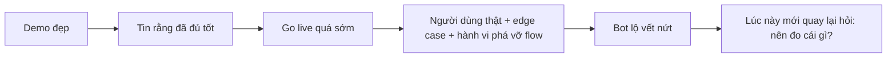

Một trong những cảnh mình thấy lặp đi lặp lại trên thị trường là: demo quá đẹp, nên mọi người quên mất production là một cuộc chơi khác hẳn.

Bot trả lời mượt trên một tập dataset lớn, coverage nhìn có vẻ rộng, dashboard thử nghiệm trông sạch sẽ, thế là nhiều công ty đi đến kết luận rằng đã có thể `go live`. Họ bỏ qua giai đoạn chạy song song, không thiết kế lớp hậu kiểm sau golive, và cũng không chuẩn bị tinh thần cho việc người dùng thật luôn tìm ra những lỗ hổng mà bộ test ban đầu chưa chạm tới.

Khi đó, vấn đề không còn là model có thông minh hay không nữa. Vấn đề là doanh nghiệp đã chọn một cách triển khai không phù hợp với thực tế vận hành của mình, rồi lại dùng sai metric để tự trấn an rằng mọi thứ đang ổn.

Đó cũng là lý do mình khá dè dặt với nhiều sản phẩm AI đang được đem đi triển khai cho doanh nghiệp. Nhìn bên ngoài, chúng vẫn có thể chạy được: vài file markdown được viết vội bằng một loạt prompt, một workflow `n8n` nối model với vector database, test thử vài vòng thấy bot trả lời có vẻ ổn là `go live`. Nhưng khi hỏi sâu hơn thì lại không có câu trả lời cho những thứ quan trọng nhất: khi nào bot phải handoff, topic nào bot đang làm chưa tốt, khoảng cách giữa bot và nhân viên thật đang là bao nhiêu, knowledge được chunk và embedding theo cách nào, các chunk đó còn giữ được nghĩa hay đã bị xé nát khỏi ngữ cảnh ban đầu. Một hệ thống như vậy có thể chạy được, nhưng rất khó gọi là đã sẵn sàng để vận hành cho doanh nghiệp.

Theo mình, trước khi hỏi "AI của mình có tốt không?", doanh nghiệp nên hỏi một câu khác khó hơn: **mình đang muốn AI đóng vai gì trong hành trình khách hàng, và mình có chấp nhận toàn bộ hệ quả của vai đó không?**

## Hai Cách Tiếp Cận, Hai Hệ Đo Khác Nhau

Theo mình, khi đưa AI vào customer journey, nhiều team product thường đang chọn giữa hai cách tiếp cận rất khác nhau, dù không phải lúc nào họ cũng gọi tên nó rõ như vậy.

Cách thứ nhất là xem AI như một lớp lọc đầu vào. Bạn không cố để bot hành xử như một nhân viên hoàn chỉnh. Bạn để nó tiếp nhận vấn đề, thu thập dữ kiện tối thiểu, giải những case đơn giản và chuyển nhanh các tình huống vượt khỏi boundary. Lời hứa giá trị của cách này khá rõ: giảm tải cho khâu tiếp nhận, phân loại và định tuyến.

Nếu đã chọn cách đó, metric nên xoay quanh việc hệ thống có lọc đúng và chuyển đúng hay không. Những chỉ số hợp lý hơn thường là `classification accuracy`, `routing precision`, `required-field completion rate`, `time to correct queue`, `false containment rate`, và cả tỷ lệ người dùng rơi rụng giữa flow intake. Một bot có thể hỏi rất đúng form, gọi tool rất sạch, nhưng nếu làm khách mệt rồi bỏ ngang thì về mặt sản phẩm vẫn là một thất bại.

Cách thứ hai là xem AI như một phần của trải nghiệm phục vụ thống nhất. Ở đây, bot không chỉ làm nhiệm vụ sàng lọc. Nó được kỳ vọng xử lý một phần công việc thật, giữ mạch hội thoại đủ tự nhiên, rồi handoff sang người theo cách ít gây khó chịu nhất. Lời hứa giá trị lúc này không còn là "route đúng", mà là "giải quyết được một phần đáng kể trước khi cần người".

Khi đó, hệ đo phải đổi hẳn. `routing accuracy` vẫn quan trọng, nhưng không còn là trung tâm. Thứ cần đo thêm là `pre-handoff quality`, `process compliance`, `handoff quality`, `pre-handoff contribution`, `repeat contact after bot`, `reopen/escalation rate`, và những tín hiệu cho biết khách có bị đẩy vào một cuộc hội thoại dài nhưng vô ích hay không. Đây là chỗ nhiều team dễ nhầm nhất: họ kỳ vọng AI tạo ra trải nghiệm liền mạch kiểu thứ hai, nhưng lại chỉ đo nó bằng bộ chỉ số của cách thứ nhất.

| Cách tiếp cận | Lời hứa giá trị | Metric nên nhìn đầu tiên | Kiểu thất bại dễ bị bỏ sót |
|---|---|---|---|
| AI như lớp lọc đầu vào | Giảm tải intake và routing | `classification accuracy`, `routing precision`, `field completion`, `time to correct queue` | Flow quá cứng, hỏi quá nhiều, khách bỏ ngang |
| AI như một phần của trải nghiệm phục vụ | Giải quyết được một phần công việc trước handoff | `pre-handoff quality`, `process compliance`, `handoff quality`, `repeat contact`, `escalation/reopen rate` | Nói mượt nhưng xử lý sai, bàn giao muộn, tăng rủi ro ở phía sau |

Sai lầm lớn nhất, theo mình, là doanh nghiệp vô thức chọn cách tiếp cận thứ hai ở phần kỳ vọng, nhưng lại chỉ đầu tư hệ đo của cách tiếp cận thứ nhất. Lúc đó dashboard vẫn có thể đẹp, vì bot route khá đúng, tool không fail nhiều, trace nhìn ổn. Nhưng trải nghiệm khách hàng và rủi ro vận hành thì vẫn âm thầm xấu đi.

Dù chọn cách tiếp cận nào, theo mình doanh nghiệp vẫn phải trả lời được ít nhất ba câu hỏi rất cơ bản. Một là: bot phải handoff ở đâu, và có kiểm soát được ngưỡng đó không. Hai là: topic nào bot đang làm chưa tốt, và mức độ chưa tốt đó đang ảnh hưởng thế nào tới khách hàng thật. Ba là: nếu đặt bot cạnh một nhân viên thật trong cùng một tình huống, khoảng cách về chất lượng đang nằm ở đâu. Nếu chưa benchmark được với con người, rất khó biết mình đang tối ưu đúng hay chỉ đang tự thấy bot ngày càng ổn hơn.

## Thị Trường Lớn Cũng Đang Dịch Chuyển Cách Đo

Điều thú vị là càng nhìn ra ngoài thị trường, mình càng thấy các đội lớn cũng đang tự điều chỉnh cách họ nói về thành công của AI chatbot.

Ngày 12/03/2026, [Intercom](https://www.intercom.com/blog/from-resolutions-to-outcomes-evolving-how-fin-delivers-value/) viết rất thẳng rằng với Fin, khi agent đi sâu hơn vào các workflow khó thì "success stopped being binary". Họ không còn xem `resolution` là thước đo duy nhất nữa, mà chuyển sang `outcome`, trong đó có cả những trường hợp bot thu thập ngữ cảnh, thực hiện một phần công việc, rồi **handoff có chủ đích** cho người hoặc workflow tiếp theo. Cùng lúc, ở tài liệu metric của họ, [Intercom](https://www.intercom.com/help/en/articles/13533623-fin-ai-agent-automation-rate) cũng định nghĩa `Automation rate = Involvement rate × Resolution rate` và khuyến nghị nhìn theo topic để biết bottleneck đang nằm ở đâu.

Điều đó rất đáng chú ý. Một trong những sản phẩm AI support lớn nhất thị trường cũng không còn nói về chuyện "bot tự resolve hết hay không" như một câu chuyện nhị phân. Họ thừa nhận rằng ở production thật, có những trường hợp bot vẫn tạo ra giá trị lớn dù cuối cùng có người tham gia. Đó là một cách nói khác của việc phải đo phần giá trị AI tạo ra trước handoff, chứ không chỉ đo kết quả cuối cùng.

Phía [Salesforce Engineering](https://engineering.salesforce.com/accelerating-agentforce-deployments-from-6-months-to-3-weeks-across-150-enterprises/) cũng cho thấy một góc nhìn rất giống. Trong các triển khai Agentforce ở hơn 150 doanh nghiệp, thứ làm dự án chậm lại không chỉ là model hay prompt, mà là governance, observability, kiến trúc dữ liệu, và đặc biệt là tình trạng `instruction bloat`. Họ mô tả có khách hàng mất ba đến bốn tháng chỉ để loay hoay xem agent của mình có thực sự đang hoạt động đúng hay không, trước khi câu chuyện testing đa lượt và observability được giải quyết tử tế.

Điểm mình thấy quan trọng nhất ở đây là: càng đi sâu vào production, thị trường càng bớt nói về một chỉ số duy nhất, và càng nói nhiều hơn về `outcome`, về observability, về multi-turn testing, về QA sau golive. Nói cách khác, cách đo đang trưởng thành cùng với vai trò mà AI được giao.

Đây cũng là lý do mình không còn tin vào câu hỏi "AI chatbot tốt là gì?" theo kiểu chung chung nữa. Một AI làm lớp intake tốt là một kiểu tốt khác. Một AI được giao nhiệm vụ xử lý trước handoff tốt lại là một kiểu khác. Vấn đề không nằm ở chuyện bot có thông minh hay không, mà nằm ở chuyện doanh nghiệp đã nói rõ bot đang hứa điều gì với khách hàng, rồi xây đúng hệ đo cho lời hứa đó chưa.

Nếu cần rút gọn hơn nữa, mình nghĩ có ba lớp đo gần như lúc nào cũng phải có, chỉ là trọng số của chúng sẽ thay đổi theo từng cách tiếp cận:

| Lớp đo | Câu hỏi chính | Ví dụ metric |
|---|---|---|
| Hành vi hệ thống | Bot có route, gọi tool, handoff đúng như thiết kế không? | `routing precision`, `tool success rate`, `trace/step compliance` |
| Chất lượng hội thoại | Phần AI tham gia có thực sự hữu ích và đúng lúc không? | `pre-handoff quality`, `handoff quality`, `customer drop-off`, `repeat contact` |
| Kết quả kinh doanh | Sau cùng nó có giảm tải, giữ trải nghiệm và giảm rủi ro không? | `resolution/outcome rate`, `reopen rate`, `escalation cost`, `policy/risk incidents` |

Lý do mình nhấn mạnh vào lớp giữa là vì nếu chỉ nhìn kết quả cuối cùng của cả cuộc hội thoại, con người rất dễ vô tình che lấp điểm yếu thật của bot. Người thật có thể cứu ca. Khách vẫn có thể hài lòng. Nhưng điều đó không có nghĩa là AI đã làm tốt phần việc của nó.

Chính ở chỗ này, những khuyến nghị từ các đội làm platform khá đáng để học. [OpenAI](https://developers.openai.com/api/docs/guides/agent-evals) khuyên nên bắt đầu bằng trace khi còn đang debug hành vi, vì lúc đó câu hỏi thật sự là: bot có chọn đúng tool không, handoff có diễn ra đúng lúc không, workflow có vi phạm instruction hay safety policy không. Ở tài liệu [trace grading](https://developers.openai.com/api/docs/guides/trace-grading), họ nói rất rõ rằng trace cần được chấm ở cấp quyết định, tool call và reasoning step, không chỉ ở output cuối cùng.

Nhưng đây cũng chính là chỗ rất dễ bị hiểu sai nếu bê nguyên cách nghĩ đó sang bài toán chatbot cho doanh nghiệp. Nếu team chỉ test xong rồi quay về theo dõi `tool fail`, `trace fail` hay exception rate, họ sẽ rất dễ kết luận bot vẫn ổn dù trải nghiệm khách hàng đang tệ đi. Rất nhiều failure đau nhất trong customer support không hiện lên dưới dạng tool lỗi: bot có thể route sai nhưng vẫn gọi tool đúng, trả lời có vẻ đúng về mặt dữ liệu nhưng làm khách bực vì sai timing, giữ case quá lâu trước khi handoff, hoặc tạo ra rủi ro vận hành và rủi ro chính sách dù trace nhìn vẫn "sạch". Vì vậy trace grading là một lớp debug cực kỳ cần thiết, nhưng nó không thể thay cho việc đo trải nghiệm khách hàng, chất lượng handoff và mức độ rủi ro doanh nghiệp sau golive.

[Anthropic](https://www.anthropic.com/engineering/demystifying-evals-for-ai-agents) cũng đi xa hơn một bước khi nói rằng agent eval chỉ thật sự có ích nếu nhìn cả transcript lẫn outcome, và nếu kết hợp được code-based graders, model-based graders, human review, production monitoring, A/B test, cùng manual transcript review. Nói cách khác, eval không phải một phòng lab sạch sẽ nằm tách khỏi production. Eval trưởng thành là một vòng lặp nối liền giữa lab và production.

Nếu không có vòng lặp kiểu này, mọi cải tiến đều rất dễ rơi vào trạng thái "cảm giác bot đang tốt hơn". Mà cảm giác là thứ cực kỳ nguy hiểm khi AI đã bắt đầu chạm vào vận hành thật.

## Cơn Khát AI Đang Đẩy Doanh Nghiệp Vào Một Kiểu Quản Lý Mới

Thời điểm này, điều mình thấy rõ không phải là thị trường đã có quá nhiều product AI đủ tốt cho doanh nghiệp. Điều mình thấy rõ hơn là một cơn khát rất lớn: các chủ doanh nghiệp đang nóng lòng đưa AI vào hoạt động hằng ngày, nhưng lớp application đủ tốt để thực sự `plug and play` với AI model vẫn còn thiếu.

Vì thế mới có cảnh rất nhiều nơi phải ghép tạm mọi thứ với nhau. Chỗ này một workflow, chỗ kia một con bot, chỗ khác lại là một bộ prompt hay một lớp knowledge dựng vội. Nó cho cảm giác là AI đã bắt đầu chạy được trong doanh nghiệp, nhưng chưa chắc đã tạo thành một hệ thống đủ chắc để tin tưởng giao việc lâu dài.

Song song với đó, mình thấy có một xu hướng rất hay: thay vì chờ một nền tảng hoàn hảo từ trên xuống, doanh nghiệp bắt đầu `power up` từng cá nhân từ dưới lên. Mỗi người tự xây cho mình một trợ lý công việc, bớt những việc tay chân lặp đi lặp lại, gom thêm thời gian và chất xám cho những thứ tạo impact lớn hơn. Ở góc nhìn này, AI không chỉ là công cụ tự động hóa. Nó đang dần trở thành một lớp tăng lực cho từng nhân sự.

Nhưng khi đi đủ xa, câu chuyện lại quay về bài toán quản trị quen thuộc. Một người được AI hỗ trợ mạnh hơn thì cũng sẽ bị đòi hỏi nhiều hơn, chịu KPI nặng hơn, muốn được trả lương cao hơn. Và từ đây, cách đánh giá cũng đổi theo. Nó không còn là câu hỏi "con người làm tốt hơn máy hay máy làm tốt hơn con người" nữa. Câu hỏi đúng hơn là: phần việc nào con người đã handoff cho máy, phần việc đó máy có đang làm tốt không, và ai đang là người chịu trách nhiệm cho mọi sai lầm xảy ra ở khúc đó.

Theo mình, đây là lúc mỗi cá nhân dần trở thành người quản lý trực tiếp của AI mà họ dùng. Họ giao việc cho AI, nhận việc lại từ AI, kiểm tra chất lượng, và chịu trách nhiệm nếu AI làm sai. Còn ở góc độ xây product, bài toán không chỉ là làm ra một con bot giỏi hơn. Bài toán là phải tạo ra một hệ thống giúp doanh nghiệp đo được mức tiến bộ của từng cá nhân, kiểm soát rủi ro đủ chặt, và đủ yên tâm khi giao việc qua lại giữa người và AI. Mình cũng đang đi trên đúng con đường đó: vừa xây nền tảng, vừa đào tạo từng cá nhân, vừa thử các phương án dựng sẵn, nhưng đích cuối cùng vẫn là làm sao để tiến bộ của mỗi người đo được, rủi ro được giữ thấp nhất, và việc giao nhận công việc với AI trở nên đáng tin hơn.

## Một Product AI Được Xây Dựng Tốt Nên Đánh Giá Thế Nào?

Nói đơn giản, mình sẽ không gọi một product AI là được xây dựng tốt chỉ vì bot chat nghe mượt, trả lời nghe thông minh hay làm đẹp trong một bộ eval dựng sẵn.

Một product AI được làm tốt phải được nhìn như một hệ thống hoàn chỉnh, chứ không phải chỉ là một con model hay một đoạn prompt. Nếu sản phẩm đó được xây để phân loại và định tuyến, thì phải đo xem nó có phân loại đúng, chuyển đúng và dừng đúng chỗ hay không. Nếu sản phẩm đó được xây để giữ mạch trải nghiệm và xử lý một phần công việc trước khi chuyển người, thì phải đo xem nó có thật sự giúp được đến đâu, hay chỉ đang làm cuộc nói chuyện dài hơn, mệt hơn và rủi ro hơn.

Công nghệ AI đang phát triển nhanh hơn cả tốc độ chúng ta kịp suy xét xem cái gì mới là tốt cho doanh nghiệp. Vì vậy, một sản phẩm AI tốt không chỉ là sản phẩm bám được model mới. Nó phải đủ linh hoạt để thay model, thay retrieval, thay workflow khi công nghệ đổi rất nhanh. Nhưng quan trọng hơn nữa, nó phải có khả năng kiểm soát và đo đạc đủ tốt để biết thay đổi nào đang làm hệ thống tốt lên thật, thay đổi nào chỉ làm dashboard đẹp hơn. Model mới nhất, mạnh nhất, đắt nhất chưa chắc là model phù hợp nhất với một doanh nghiệp cụ thể.

> **Bài toán muôn thuở của phần mềm vẫn không đổi: build một thứ chạy được thì dễ hơn build đúng thứ doanh nghiệp cần. Với product AI cũng vậy. Thứ quan trọng nhất vẫn là biết nên đo cái gì để tìm đúng chỗ cần "gõ búa" vào cỗ máy.**

## Những Bài Nên Đọc Nếu Muốn Đào Sâu Hơn

- [Intercom: From resolutions to outcomes](https://www.intercom.com/blog/from-resolutions-to-outcomes-evolving-how-fin-delivers-value/)
- [Intercom: Fin AI Agent automation rate](https://www.intercom.com/help/en/articles/13533623-fin-ai-agent-automation-rate)
- [Intercom: Fin AI Agent outcomes](https://www.intercom.com/help/en/articles/8205718-fin-ai-agent-outcomes)
- [Salesforce Engineering: Accelerating Agentforce deployments](https://engineering.salesforce.com/accelerating-agentforce-deployments-from-6-months-to-3-weeks-across-150-enterprises/)
- [Anthropic: Demystifying evals for AI agents](https://www.anthropic.com/engineering/demystifying-evals-for-ai-agents)
- [OpenAI: Evaluate agent workflows](https://developers.openai.com/api/docs/guides/agent-evals)
- [OpenAI: Trace grading](https://developers.openai.com/api/docs/guides/trace-grading)
- [Zendesk QA: Evaluating the performance of AI agents](https://support.zendesk.com/hc/en-us/articles/7418648293018-Evaluating-the-performance-of-AI-agents-using-Zendesk-QA)