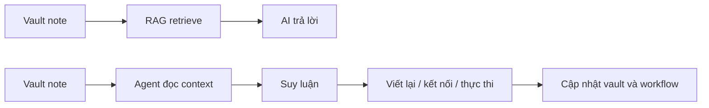

Nếu nhìn vào vault Obsidian hiện tại của mình, nhiều người sẽ tưởng đây là kết quả của một lần ngồi xuống thiết kế hệ thống thật bài bản, chọn framework xong rồi triển khai theo.

Nhưng thực tế không phải vậy.

Hệ thống quản lý tri thức cá nhân của mình là thứ đã **tiến hoá liên tục qua nhiều năm**.
Mỗi giai đoạn công việc, mỗi lần thấy mình tìm lại note khó hơn, viết xong mà không dùng lại được, hay lưu nhiều nhưng nghĩ không rõ hơn, mình lại chỉnh tiếp một chút.

Ban đầu nó chỉ là những folder rất đơn giản để đỡ quên.
Sau đó mình bắt đầu phân tách theo nhu cầu sử dụng.
Rồi đến lúc công việc phức tạp hơn, số lượng note nhiều hơn, mình cần một cách nhìn rõ hơn xem thông tin đang phục vụ cho việc gì, di chuyển ra sao, và bằng cách nào nó quay trở lại giúp mình ra quyết định.

Nên với mình, `PARA` hay `FLOW` không phải là điểm bắt đầu.
Chúng chỉ là những cái tên đến sau, giúp mình mô tả rõ hơn một tư duy đã được mài dũa qua rất nhiều lần thử, sai, sửa và dùng lại.

Từ rất lâu trước khi có AI, mình đã có xu hướng:

- nhặt những mẩu thông tin rời rạc từ công việc, cuộc sống, sách, internet
- ghi lại theo cách đủ ngắn để không bị lười
- quay lại viết rõ hơn khi mình bắt đầu hiểu bản chất
- rồi gắn nó vào một vấn đề cụ thể trong công việc hoặc cuộc sống

Nhìn lại, mình thấy toàn bộ hệ thống đó luôn xoay quanh một luồng quen thuộc:
**thu nạp -> diễn giải -> kết nối -> sử dụng lại**.

Điều thay đổi theo thời gian chỉ là cách mình tổ chức luồng đó cho bền hơn, dễ dùng hơn, và ngày càng ít phụ thuộc vào trí nhớ ngắn hạn của chính mình.

---

## PARA là một cột mốc trong quá trình mình làm hệ thống rõ ràng hơn

Sau nhiều lần tự chỉnh folder và cách ghi chép, mình nhận ra vấn đề lớn nhất không phải là thiếu chỗ để lưu.
Vấn đề là mình cần một khung đủ rõ để biết một mẩu thông tin đang đứng ở đâu trong đời sống làm việc của mình.

Khi gặp `PARA`, mình thấy nó hữu ích vì nó trả lời rất đúng câu hỏi đó.

Thay vì bắt mình phân loại tri thức theo kiểu hàn lâm, nó gợi mở một câu hỏi thực tế hơn:

> Mẩu thông tin này đang phục vụ cho việc gì trong đời sống hiện tại của mình?

Với mình:

- `Projects` là những thứ đang cần hành động
- `Areas` là những phần đời sống và công việc cần duy trì chất lượng lâu dài
- `Resources` là nơi nuôi dưỡng kiến thức nền
- `Archive` là ký ức có tổ chức, không phải thùng rác

Nghe thì giống một hệ thống quản lý file.
Nhưng điều quan trọng hơn là nó khớp với cách mình đã dần hình thành tư duy trước đó:
mọi thông tin đều chỉ có giá trị khi nó đứng trong một **ngữ cảnh sử dụng**.

Nếu không có ngữ cảnh, note rất dễ biến thành đồ sưu tầm.
Đẹp, nhiều, nhưng không giúp mình sống hay làm việc tốt hơn.

Nên với mình, PARA không phải một công thức thần kỳ.
Nó là một cột mốc giúp hệ thống mình đang có trở nên sáng sủa hơn.
Nó cho mình một cấu trúc để tiếp tục phát triển, chứ không thay thế việc mình phải tự hiểu mình đang học, đang làm và đang cần gì.

---

## FLOW là cách mình nhìn sự tiến hoá của thông tin bên trong hệ thống đó

Nếu PARA trả lời câu hỏi "nên đặt note ở đâu", thì FLOW trả lời câu hỏi mình quan tâm hơn:

> Một mẩu thông tin sẽ đi qua đời mình như thế nào để cuối cùng trở thành giá trị thực?

Qua nhiều năm dùng note, mình nhận ra folder chỉ giải quyết được một nửa bài toán.
Nó cho mình biết nên đặt thông tin ở đâu, nhưng chưa chắc giúp mình thấy được thông tin đó sẽ sống tiếp như thế nào.

Đó là lúc mình bắt đầu nhìn vault như một dòng chảy thay vì một thư viện tĩnh.

Một ý tưởng có thể bắt đầu ở trạng thái rất thô:
- một dòng note nhanh
- một đoạn chat
- một quan sát khi đang làm việc
- một bài viết đọc dở nhưng thấy có gì đó đáng giữ lại

Sau đó nó được kéo qua nhiều lớp:

1. **Capture**: giữ lại trước khi nó biến mất
2. **Interpret**: viết lại bằng ngôn ngữ của mình để kiểm tra mình đã hiểu chưa
3. **Connect**: nối nó với các dự án, vấn đề, con người hoặc quyết định thật
4. **Execute**: biến nó thành hành động, bài viết, tài liệu, prompt, spec hoặc workflow
5. **Reflect**: sau khi dùng xong thì quay lại học thêm từ chính kết quả đó

Đó là cách mình hiểu chữ `FLOW`.
Không phải một framework để thay PARA, mà là một góc nhìn bổ sung:
**tri thức chỉ sống khi nó tiếp tục được dịch chuyển**.

Mình không muốn một kho note chỉ để tra cứu.
Mình muốn một hệ thống mà mỗi lần mình đọc, viết, làm việc, hoặc ra quyết định, những mảnh tri thức cũ có cơ hội quay lại đúng lúc và đúng việc.

---

## Năm 2024 mình thử đưa AI vào vault bằng tư duy RAG-first

Từ năm 2024, mình đã bắt đầu nghiêm túc đi tìm cách tích hợp AI vào thư viện kiến thức cá nhân.

Lúc đó, hướng đi phổ biến nhất gần như là:

- gom toàn bộ note
- làm sạch dữ liệu
- chunk tài liệu
- embed vào vector database
- rồi cho AI truy xuất bằng RAG

Ở thời điểm đó, đây là hướng đi rất tự nhiên.
Mình không xem nó là một ngõ cụt hay một ý tưởng tệ.
Ngược lại, chính quá trình thử nghiêm túc với RAG giúp mình hiểu rõ hơn vault cá nhân của mình thực sự vận hành như thế nào.

Và khi làm đủ sâu, mình bắt đầu thấy ra những đặc điểm rất riêng của một second brain "đang sống".

### 1. Vault cá nhân không phải dữ liệu tĩnh

Một second brain thật sự luôn thay đổi.
Mình thêm note mới, sửa note cũ, đổi tên, chuyển thư mục, viết nửa chừng, bỏ dở, nối lại, merge ý tưởng, tách ý tưởng.

Trong khi đó, RAG workflow thời điểm đó muốn dữ liệu càng ổn định càng tốt.
Nó thích những tài liệu đã "chuẩn hoá", ít đổi cấu trúc, ít mơ hồ.

Vault của mình thì ngược lại:
nó là một nơi đang nghĩ dở, không phải thư viện đã đóng gói.

### 2. Mình nhận ra hệ thống note cá nhân phải phục vụ tư duy trước

Để RAG chạy ổn, mình phải liên tục nghĩ:

- note này viết thế nào để chunk đẹp hơn
- heading này chia sao để retrieval dễ hơn
- metadata nào cần thêm cho pipeline
- wiki-link, embed, attachment, callout sẽ xử lý ra sao

Quá trình đó cho mình một bài học rất rõ:
mọi hệ thống quản lý tri thức cá nhân nếu muốn sống lâu thì phải phục vụ cách mình tư duy trước, rồi mới tính đến chuyện phục vụ máy.

Khi việc ghi chép bắt đầu mất tự nhiên, hệ thống sớm muộn cũng bị bỏ dở.

### 3. Mình chưa tìm được mức tự động hoá đủ liền mạch

Mình có thể viết script, làm pipeline, sync dữ liệu, re-index định kỳ.
Nhưng cứ mỗi chỗ phát sinh ngoại lệ là mình lại phải vá thêm một lớp.

Rồi đến lúc mình nhận ra một điều khá quan trọng:

> Nếu hệ thống tri thức cá nhân cần quá nhiều thao tác bảo trì để AI dùng được, thì nó vẫn chưa thật sự hòa vào đời sống làm việc của mình.

Điểm nghẽn không nằm ở việc RAG có thông minh hay không.
Điểm nghẽn nằm ở chỗ workflow đó lúc ấy chưa đủ "vô hình" để trở thành một phần tự nhiên của đời sống làm việc hằng ngày.

Vậy nên mình tạm dừng hướng đó.
Không phải để phủ nhận nó, mà để chờ một thời điểm phù hợp hơn, khi công nghệ và workflow có thể khớp với nhau tốt hơn.

---

## Agentic AI là bước tiếp theo trong hành trình tiến hoá đó

Điều làm mình thấy khác biệt nhất ở làn sóng Agentic AI hiện tại là:
AI không còn chỉ đứng ở vai trò truy xuất và trả lời.

Nó bắt đầu có khả năng:

- đọc nhiều nguồn context khác nhau
- hiểu mục tiêu đang cần đạt
- tự chọn bước kế tiếp
- thao tác trên hệ thống, file, workflow, tools
- và quan trọng nhất là giữ được mạch công việc xuyên suốt nhiều bước

Sự khác nhau giữa hai thế hệ này, ít nhất với workflow cá nhân của mình, có thể hình dung rất đơn giản:

RAG giúp mình nghĩ rõ hơn về dữ liệu và truy xuất.
Agentic AI mở rộng thêm một bước quan trọng:
**lấy đúng context rồi biến nó thành hành động tiếp theo trong workflow**.

Với mình, đây không phải là một cú bẻ lái phủ nhận chặng cũ.
Nó là bước tiếp theo rất tự nhiên của cùng một hành trình.

Mình không còn cần phải cố ép mọi thứ trong vault thành dữ liệu sạch hoàn hảo trước.
Giờ mình có thể để agent cùng tham gia vào quá trình:

- đọc note còn dang dở
- suy ra bối cảnh từ thư mục, metadata, link và các tài liệu liên quan
- giúp chuẩn hoá dần trong lúc làm việc
- viết, tóm tắt, kết nối, tái cấu trúc, xuất bản hoặc biến nó thành output thực tế

Nói cách khác, AI không còn chỉ ngồi ở cuối pipeline để "trả lời".
Nó có thể đi vào giữa dòng chảy tri thức và cùng mình đẩy dòng chảy đó tiến lên.

---

## Second brain của mình bây giờ được nâng cấp theo cách nào

Nếu nhìn từ bên ngoài, có thể nhiều người sẽ nghĩ mình chỉ đang gắn AI vào Obsidian.
Nhưng với mình, sự nâng cấp thật sự sâu hơn thế nhiều.

### 1. Từ kho lưu trữ sang workspace cộng tác

Vault giờ không chỉ là nơi mình cất note.
Nó trở thành một môi trường để mình và agent cùng làm việc.

Một note có thể bắt đầu là ghi chú rất thô, nhưng sau đó agent có thể:

- giúp mình làm rõ ý
- đề xuất cấu trúc lại
- nối với bài cũ hoặc dự án liên quan
- chuyển từ ý rời thành bài viết hoàn chỉnh
- hoặc biến nó thành checklist, spec, prompt hay workflow thực thi

### 2. Từ tìm kiếm thông tin sang gọi lại đúng ngữ cảnh

Trước đây, nỗi đau lớn nhất không phải là "mình không có thông tin".
Mà là "mình không nhớ đúng lúc để dùng nó".

Agentic AI giúp giải bài toán đó tốt hơn vì nó không chỉ search bằng vector.
Nó đọc theo ngữ cảnh của task hiện tại:

- mình đang viết gì
- đang làm dự án nào
- note này nằm ở stage nào trong PARA
- tài liệu nào liên quan nhất để kéo vào

Điều mình nhận lại không chỉ là câu trả lời, mà là **đúng bối cảnh để tiếp tục suy nghĩ**.

### 3. Từ ghi chép thụ động sang vòng lặp học tập có output

Thứ mình thích nhất là vault không còn dừng ở "ghi cho đỡ quên".
Nó bắt đầu trở thành nơi sản sinh output:

- bài viết
- prompt
- tài liệu công việc
- kế hoạch sản phẩm
- SOP
- workflow automation

Và mỗi output đó lại quay trở lại làm giàu cho vault.
Đó là lúc `FLOW` thật sự sống.

### 4. Từ hệ thống lưu trữ sang hệ thống tự làm giàu dần

Đây là điểm mình thấy rõ nhất sau nhiều năm tinh chỉnh workflow.

Trước đây, mỗi lần muốn AI dùng được dữ liệu, mình phải là người dọn dẹp trước.
Bây giờ, trong nhiều trường hợp, chính agent có thể giúp mình dọn dẹp trong lúc sử dụng:

- chuẩn hoá frontmatter
- gợi ý tags
- đổi tên file
- tái cấu trúc note
- biến note nháp thành bài hoàn chỉnh

Tức là thay vì một mình mình liên tục dọn đường cho hệ thống, giờ mình có thêm một lớp hỗ trợ để hệ thống tự trưởng thành dần trong quá trình sử dụng.

---

## Điều mình tin nhất lúc này: tư duy quan trọng hơn công cụ

Sau tất cả những lần đổi folder, đổi cách đặt tên, đổi workflow, thử đưa AI vào bằng RAG, rồi nâng cấp tiếp với agent, điều mình tin nhất lại rất đơn giản:

**công cụ không phải phần quyết định chất lượng của hệ thống tri thức cá nhân**.

Obsidian có thể thay bằng công cụ khác.
PARA có thể được diễn giải theo kiểu khác.
FLOW cũng có thể được gọi bằng một tên khác.
Ngay cả lớp AI hỗ trợ hôm nay vài năm nữa chắc chắn cũng sẽ khác.

Nhưng nếu phần lõi không rõ, thì đổi công cụ mấy lần cũng chỉ là thay vỏ.

Phần lõi đó, với mình, là:

- mình thu nạp thông tin như thế nào
- mình diễn giải nó bằng ngôn ngữ của mình ra sao
- mình kết nối nó với công việc và cuộc sống thế nào
- và mình có biến nó thành hành động hay không

Khi phần lõi đó rõ, công cụ mới thật sự có đất để phát huy.

Vì vậy, một second brain hữu ích hơn khi nó giống một **hệ điều hành cho tri thức cá nhân**:

- có cấu trúc đủ rõ để không loạn
- có dòng chảy đủ linh hoạt để thông tin không bị chết
- có agent đủ hiểu ngữ cảnh để đồng hành cùng mình
- và có khả năng biến hiểu biết thành hành động, không chỉ thành câu trả lời

PARA giúp mình có filesystem cho tư duy.
FLOW giúp mình không quên rằng thông tin cần được di chuyển.
Agentic AI giúp mình làm việc với hệ thống đó sâu hơn và nhanh hơn.

Với mình, đây mới là lúc second brain thật sự được nâng cấp.

Không phải vì mình có thêm một chatbot biết đọc note.
Mà vì sau nhiều năm tiến hoá, cuối cùng mình đã có một hệ thống mà:

- cách mình ghi chép tự nhiên
- cách mình suy nghĩ
- cách mình làm việc
- và cách AI hỗ trợ

... bắt đầu khớp với nhau.

Và khi những thứ đó khớp với nhau, vault không còn là nơi "lưu kiến thức".
Nó trở thành một phần mở rộng của cách mình học, nghĩ và tạo ra giá trị mỗi ngày.