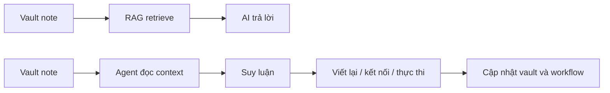

Mỗi lần ai đó nhìn vào vault Obsidian hiện tại của mình và hỏi về `PARA`, `FLOW`, hay cách mình tổ chức second brain, mình thường có một cảm giác khá buồn cười:

thực ra mình không ngồi xuống để "phát minh ra một framework quản lý tri thức".

Thứ đang có trong vault hiện tại phần lớn chỉ là **một phiên bản được gọi tên rõ ràng hơn của thói quen thu nạp và diễn giải thông tin mà mình đã làm từ rất lâu**.

Từ trước khi có AI, mình đã có xu hướng:

- nhặt những mẩu thông tin rời rạc từ công việc, cuộc sống, sách, internet
- ghi lại theo cách đủ ngắn để không bị lười
- rồi quay lại viết dài hơn khi mình thật sự hiểu nó
- sau đó gắn nó vào một vấn đề cụ thể nào đó trong công việc hoặc cuộc sống

Nói cách khác, mình vốn đã sống theo một luồng:
**thu nạp -> diễn giải -> kết nối -> sử dụng lại**.

Sau này khi dùng Obsidian nhiều hơn, mình chỉ đang cố tìm một cấu trúc đủ bền để cái luồng đó không bị vỡ khi số lượng note ngày càng lớn. Và rồi `PARA` xuất hiện như phần khung tổ chức, còn `FLOW` là cách mình nhìn sự dịch chuyển của thông tin bên trong cái khung đó.

---

## PARA với mình không phải phương pháp mới, mà là cách đặt tên cho thứ mình đã làm sẵn

Điều mình thích ở PARA là nó rất thực dụng.
Nó không bắt mình phải phân loại tri thức theo kiểu hàn lâm hay cố dự đoán "note này thuộc lĩnh vực nào".

Thay vào đó, nó hỏi một câu đơn giản hơn:

> Mẩu thông tin này đang phục vụ cho việc gì trong đời sống hiện tại của mình?

Với mình:

- `Projects` là những thứ đang cần hành động
- `Areas` là những phần đời sống và công việc cần duy trì chất lượng lâu dài
- `Resources` là nơi nuôi dưỡng kiến thức nền
- `Archive` là ký ức có tổ chức, không phải thùng rác

Nghe rất giống một hệ thống quản lý file.
Nhưng lý do nó hợp với mình là vì nó khớp với đúng cách mình tư duy từ trước:
mọi thông tin đều chỉ có giá trị khi nó đứng trong một **ngữ cảnh sử dụng**.

Nếu không có ngữ cảnh, note rất dễ biến thành đồ sưu tầm.
Đẹp, nhiều, nhưng không giúp mình sống hay làm việc tốt hơn.

Nên nếu phải nói ngắn gọn, PARA không khiến mình trở nên ngăn nắp.
Nó chỉ làm lộ ra cái logic vốn đã có sẵn trong đầu: **thông tin phải đi cùng trách nhiệm, nhu cầu và hành động**.

---

## FLOW là phần quan trọng hơn: thông tin phải di chuyển chứ không được nằm im

Nếu PARA trả lời câu hỏi "nên đặt note ở đâu", thì FLOW trả lời câu hỏi mình quan tâm hơn:

> Một mẩu thông tin sẽ đi qua đời mình như thế nào để cuối cùng trở thành giá trị thực?

Đó là lý do mình không nhìn vault như một thư viện tĩnh.
Mình nhìn nó như một dòng chảy.

Một ý tưởng có thể bắt đầu ở trạng thái rất thô:
- một dòng note nhanh
- một đoạn chat
- một quan sát khi đang làm việc
- một bài viết đọc dở nhưng thấy có gì đó đáng giữ lại

Sau đó nó được kéo qua nhiều lớp:

1. **Capture**: giữ lại trước khi nó biến mất
2. **Interpret**: viết lại bằng ngôn ngữ của mình để kiểm tra mình đã hiểu chưa
3. **Connect**: nối nó với các dự án, vấn đề, con người hoặc quyết định thật
4. **Execute**: biến nó thành hành động, bài viết, tài liệu, prompt, spec hoặc workflow
5. **Reflect**: sau khi dùng xong thì quay lại học thêm từ chính kết quả đó

Đó là cách mình hiểu chữ `FLOW`.
Không phải một framework cầu kỳ, mà là một lời nhắc:
**tri thức chỉ sống khi nó tiếp tục được dịch chuyển**.

Thứ mình muốn xây không phải là một kho note để "tra cứu cho sướng".
Mình muốn một hệ thống mà mỗi lần mình đọc, viết, làm việc, hoặc ra quyết định, những mảnh tri thức cũ có cơ hội quay lại đúng lúc.

---

## Năm 2024 mình từng rất muốn biến cả vault này thành một RAG database

Từ năm 2024, mình đã bắt đầu nghiêm túc đi tìm cách tích hợp AI vào thư viện kiến thức cá nhân.

Lúc đó, hướng đi phổ biến nhất gần như là:

- gom toàn bộ note
- làm sạch dữ liệu
- chunk tài liệu
- embed vào vector database
- rồi cho AI truy xuất bằng RAG

Nghe rất hợp lý.
Và ở mức lý thuyết, mình vẫn nghĩ nó đúng trong nhiều bài toán.

Vấn đề là khi mình cố áp nó vào một vault cá nhân đang sống, mình bắt đầu thấy những ma sát rất thật.

### 1. Vault cá nhân không phải dữ liệu tĩnh

Một second brain thật sự luôn thay đổi.
Mình thêm note mới, sửa note cũ, đổi tên, chuyển thư mục, viết nửa chừng, bỏ dở, nối lại, merge ý tưởng, tách ý tưởng.

Trong khi đó, RAG workflow thời điểm đó muốn dữ liệu càng ổn định càng tốt.
Nó thích những tài liệu đã "chuẩn hoá", ít đổi cấu trúc, ít mơ hồ.

Vault của mình thì ngược lại:
nó là một nơi đang nghĩ dở, không phải thư viện đã đóng gói.

### 2. Mình phải tối ưu cho máy trước khi tối ưu cho bản thân

Đây là điểm khiến mình khó chịu nhất.

Để RAG chạy ổn, mình phải liên tục nghĩ:

- note này viết thế nào để chunk đẹp hơn
- heading này chia sao để retrieval dễ hơn
- metadata nào cần thêm cho pipeline
- wiki-link, embed, attachment, callout sẽ xử lý ra sao

Tức là thay vì để hệ thống phục vụ cách mình tư duy, mình lại phải uốn cách ghi chép của mình theo nhu cầu của pipeline.

Một khi việc ghi chép bắt đầu mất tự nhiên, mình biết kiểu gì mình cũng bỏ.

### 3. Workflow không tự động hoá hoàn toàn được

Mình có thể viết script, làm pipeline, sync dữ liệu, re-index định kỳ.
Nhưng cứ mỗi chỗ phát sinh ngoại lệ là mình lại phải vá thêm một lớp.

Rồi đến lúc mình nhận ra một sự thật khá đơn giản:

> Nếu hệ thống tri thức cá nhân cần quá nhiều thao tác bảo trì để AI dùng được, thì sớm muộn gì mình cũng ngừng dùng nó.

Điểm nghẽn không nằm ở việc RAG có thông minh hay không.
Điểm nghẽn nằm ở chỗ workflow đó chưa đủ "vô hình" để trở thành một phần tự nhiên của đời sống làm việc hằng ngày.

Vậy là mình dừng.
Không phải vì mình hết tin vào AI.
Mình dừng vì mình không muốn biến second brain thành một dự án dữ liệu mà bản thân phải làm full-time maintainer.

---

## Agentic AI thay đổi cuộc chơi vì nó không chỉ truy xuất, nó còn biết đi tiếp

Điều làm mình thấy khác biệt nhất ở làn sóng Agentic AI hiện tại là:
AI không còn chỉ đứng ở vai trò "trả lời dựa trên dữ liệu đã retrieve".

Nó bắt đầu có khả năng:

- đọc nhiều nguồn context khác nhau
- hiểu mục tiêu đang cần đạt
- tự chọn bước kế tiếp
- thao tác trên hệ thống, file, workflow, tools
- và quan trọng nhất là giữ được mạch công việc xuyên suốt nhiều bước

Sự khác nhau giữa hai thế hệ này, ít nhất với workflow cá nhân của mình, có thể hình dung rất đơn giản:

RAG mạnh ở việc "tìm cái liên quan".
Agentic AI mạnh ở việc **lấy cái liên quan rồi biến nó thành bước hành động tiếp theo**.

Đó là khác biệt mình đã chờ suốt từ 2024.

Mình không còn cần phải cố ép mọi thứ trong vault thành dữ liệu sạch hoàn hảo trước.
Giờ mình có thể để agent cùng tham gia vào quá trình:

- đọc note còn dang dở
- suy ra bối cảnh từ thư mục, metadata, link và các tài liệu liên quan
- giúp chuẩn hoá dần trong lúc làm việc
- viết, tóm tắt, kết nối, tái cấu trúc, xuất bản hoặc biến nó thành output thực tế

Nói cách khác, AI không còn chỉ ngồi ở cuối pipeline để "trả lời".
Nó có thể vào giữa dòng chảy tri thức và cùng mình đẩy dòng chảy đó tiến lên.

---

## Second brain của mình bây giờ được nâng cấp theo cách nào

Nếu nhìn từ bên ngoài, có thể nhiều người sẽ nghĩ mình chỉ đang gắn AI vào Obsidian.
Nhưng với mình, sự nâng cấp thật sự sâu hơn thế nhiều.

### 1. Từ kho lưu trữ sang workspace cộng tác

Vault giờ không chỉ là nơi mình cất note.
Nó trở thành một môi trường để mình và agent cùng làm việc.

Một note có thể bắt đầu là ghi chú rất thô, nhưng sau đó agent có thể:

- giúp mình làm rõ ý
- đề xuất cấu trúc lại
- nối với bài cũ hoặc dự án liên quan
- chuyển từ ý rời thành bài viết hoàn chỉnh
- hoặc biến nó thành checklist, spec, prompt hay workflow thực thi

### 2. Từ tìm kiếm thông tin sang gọi lại đúng ngữ cảnh

Trước đây, nỗi đau lớn nhất không phải là "mình không có thông tin".
Mà là "mình không nhớ đúng lúc để dùng nó".

Agentic AI giúp giải bài toán đó tốt hơn vì nó không chỉ search bằng vector.
Nó đọc theo ngữ cảnh của task hiện tại:

- mình đang viết gì
- đang làm dự án nào
- note này nằm ở stage nào trong PARA
- tài liệu nào liên quan nhất để kéo vào

Điều mình nhận lại không chỉ là câu trả lời, mà là **đúng bối cảnh để tiếp tục suy nghĩ**.

### 3. Từ ghi chép thụ động sang vòng lặp học tập có output

Thứ mình thích nhất là vault không còn dừng ở "ghi cho đỡ quên".
Nó bắt đầu trở thành nơi sản sinh output:

- bài viết
- prompt
- tài liệu công việc
- kế hoạch sản phẩm
- SOP
- workflow automation

Và mỗi output đó lại quay trở lại làm giàu cho vault.
Đó là lúc `FLOW` thật sự sống.

### 4. Từ hệ thống cần bảo trì sang hệ thống tự làm giàu dần

Đây là điểm khác biệt rất lớn so với thời mình cố làm RAG-first.

Trước đây, mỗi lần muốn AI dùng được dữ liệu, mình phải là người dọn dẹp trước.
Bây giờ, trong nhiều trường hợp, chính agent có thể giúp mình dọn dẹp trong lúc sử dụng:

- chuẩn hoá frontmatter
- gợi ý tags
- đổi tên file
- tái cấu trúc note
- biến note nháp thành bài hoàn chỉnh

Tức là thay vì "mình bảo trì để AI dùng được", mình bắt đầu có cảm giác "AI đang giúp mình bảo trì để cả hai cùng dùng tốt hơn".

---

## Điều mình nhận ra: second brain không cần giống database, nó cần giống một hệ điều hành

Có lẽ đây là thay đổi lớn nhất trong cách mình nhìn toàn bộ hệ thống này.

Trước đây, mình từng nghĩ muốn AI dùng được knowledge thì knowledge phải giống database:
chuẩn, sạch, indexable, queryable.

Bây giờ mình nghĩ khác.

Một second brain hữu ích hơn khi nó giống một **hệ điều hành cho tri thức cá nhân**:

- có cấu trúc đủ rõ để không loạn
- có dòng chảy đủ linh hoạt để thông tin không bị chết
- có agent đủ hiểu ngữ cảnh để đồng hành cùng mình
- và có khả năng biến hiểu biết thành hành động, không chỉ thành câu trả lời

PARA giúp mình có filesystem cho tư duy.
FLOW giúp mình không quên rằng thông tin cần được di chuyển.
Agentic AI giúp cả hai thứ đó không còn là một sơ đồ đẹp trên giấy, mà trở thành một workflow sống được mỗi ngày.

Với mình, đây mới là lúc second brain thật sự được nâng cấp.

Không phải vì mình có thêm một chatbot biết đọc note.
Mà vì cuối cùng mình đã có một hệ thống mà:

- cách mình ghi chép tự nhiên
- cách mình suy nghĩ
- cách mình làm việc
- và cách AI hỗ trợ

... bắt đầu khớp với nhau.

Và khi những thứ đó khớp với nhau, vault không còn là nơi "lưu kiến thức".
Nó trở thành một phần mở rộng của cách mình học, nghĩ và tạo ra giá trị mỗi ngày.